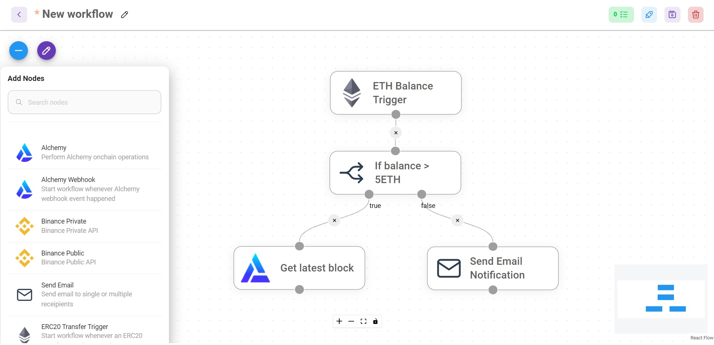

import Callout from 'nextra-theme-docs/callout'

# Workflows

Workflow is a series of actions, designed to be executed automatically without human intervention, to carry out specific task more efficiently. In simpler term: if X happens, execute Y.
Nodes are used to execute those actions, and they are connected via edges to form a workflow.

Workflow can only be started when "something" happened. Trigger or Webhook nodes are used to specify those events. 
For instance, if ETH balance in my wallet exceeds 5ETH, send me an email notification, otherwise get the latest mined block.

<br />
 


## Workflow format

Outerbridge workflow uses [JSON](https://en.wikipedia.org/wiki/JSON) format. Workflow can be easily exported and loaded.

Example of workflow:

```json
{
  "nodes": [
    {
      "width": 200,
      "height": 66,
      "id": "ETHBalanceTrigger_0",
      "position": {
        "x": 639.9142135623731,
        "y": 117.47918471982868
      },
      "type": "customNode",
      "data": {
        "label": "ETH Balance Trigger",
        "name": "ETHBalanceTrigger",
        "type": "trigger",
        "inputAnchors": [],
        "outputAnchors": [
          {
            "id": "ETHBalanceTrigger_0-output-0"
          }
        ],
        "selected": false
      },
      "selected": false,
      "positionAbsolute": {
        "x": 639.9142135623731,
        "y": 117.47918471982868
      },
      "dragging": false
    },
    {
      "width": 200,
      "height": 66,
      "id": "ifElse_0",
      "position": {
        "x": 640.5,
        "y": 229.75
      },
      "type": "customNode",
      "data": {
        "label": "If balance > 5ETH",
        "name": "ifElse",
        "type": "action",
        "inputAnchors": [
          {
            "id": "ifElse_0-input-0"
          }
        ],
        "outputAnchors": [
          {
            "id": "ifElse_0-output-0"
          },
          {
            "id": "ifElse_0-output-1"
          }
        ],
        "selected": false
      },
      "selected": false,
      "positionAbsolute": {
        "x": 640.5,
        "y": 229.75
      },
      "dragging": false
    },
    {
      "width": 200,
      "height": 66,
      "id": "alchemy_0",
      "position": {
        "x": 513.3040405071067,
        "y": 340.74137802864846
      },
      "type": "customNode",
      "data": {
        "label": "Get latest block",
        "name": "alchemy",
        "type": "action",
        "inputAnchors": [
          {
            "id": "alchemy_0-input-0"
          }
        ],
        "outputAnchors": [
          {
            "id": "alchemy_0-output-0"
          }
        ],
        "selected": false
      },
      "selected": false,
      "positionAbsolute": {
        "x": 513.3040405071067,
        "y": 340.74137802864846
      },
      "dragging": false
    },
    {
      "width": 200,
      "height": 66,
      "id": "emailSend_0",
      "position": {
        "x": 782.8309524416879,
        "y": 344.08452377915603
      },
      "type": "customNode",
      "data": {
        "label": "Send Email Notification",
        "name": "emailSend",
        "type": "action",
        "inputAnchors": [
          {
            "id": "emailSend_0-input-0"
          }
        ],
        "outputAnchors": [
          {
            "id": "emailSend_0-output-0"
          }
        ],
        "selected": false
      },
      "selected": false,
      "positionAbsolute": {
        "x": 782.8309524416879,
        "y": 344.08452377915603
      },
      "dragging": false
    }
  ],
  "edges": [
    {
      "source": "ETHBalanceTrigger_0",
      "sourceHandle": "ETHBalanceTrigger_0-output-0",
      "target": "ifElse_0",
      "targetHandle": "ifElse_0-input-0",
      "type": "buttonedge",
      "id": "ETHBalanceTrigger_0-ETHBalanceTrigger_0-output-0-ifElse_0-ifElse_0-input-0",
      "data": {
        "label": ""
      }
    },
    {
      "source": "ifElse_0",
      "sourceHandle": "ifElse_0-output-0",
      "target": "alchemy_0",
      "targetHandle": "alchemy_0-input-0",
      "type": "buttonedge",
      "id": "ifElse_0-ifElse_0-output-0-alchemy_0-alchemy_0-input-0",
      "data": {
        "label": "true"
      }
    },
    {
      "source": "ifElse_0",
      "sourceHandle": "ifElse_0-output-1",
      "target": "emailSend_0",
      "targetHandle": "emailSend_0-input-0",
      "type": "buttonedge",
      "id": "ifElse_0-ifElse_0-output-1-emailSend_0-emailSend_0-input-0",
      "data": {
        "label": "false"
      }
    }
  ]
}
```

## Deploy workflow

Once a workflow is deployed, it will stay active and listen to event specified by Trigger node, or webhook call from Webhook node. 
Deployed workflow will automatically kick off an execution through the connected nodes when an event/webhook is received. 

## Under the hood
Outerbridge uses [child_process](https://nodejs.org/api/child_process.html) module to spawns multiple subprocesses whenever a workflow is to be executed. 
[Node AbortController](https://www.npmjs.com/package/node-abort-controller) is used to abort subprocesses. 
Breadth First Search algorithm is used to find and execute next connected nodes. To avoid infinite loop, maximum of 3 loops is specified. This means Outerbridge will only executes the same loop for 3 times before terminating the execution.

[View Source Code](https://github.com/Outerbridgeio/Outerbridge/blob/master/packages/server/src/ChildProcess.ts#L36)